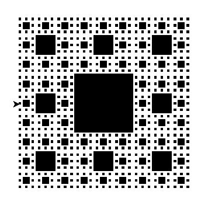

Computer Programming Overview
=============================

What is computer programming?    
-----------------------------
* The craft of writing useful, maintainable, and extensible source code
* Computer programs are scripts that are interpreted by the computer to do exactly what the programmer tells them to do.
* Programs are stupid - they can do powerful things, but only because the programmer told them to do it.


What is it used for?
--------------------
Machine learning, Robotics, Computer Vision, Image Processing, Pattern Recognition, Data Mining, Evolutionary Computation, Knowledge Representation, Natural Language Processing


Why should you learn it?
------------------------
* Not everyone who writes code has to be a software developer
* Reasons to learn to program:
    * Automate repetitive tasks
    * Understand how technology functions
    * Better communicate with developers that you're working with


What is scripting?
------------------
Scripts are programs that are designed for a particular use-case that automate some sort of task. Scripting is for peole that want to make their lives easier with simple programs.

* Emailing a collection of users
* Analyzing a data file and creating plots
* Aggregating individual PowerPoint slides into one presentation
* Scrape university website and alert you if classes are cancelled 

Introduction to Python
======================

Today, we're going to learn Python.
-----------------------------------
* Open-source: the source (original code) that composes Python is freely available for anybody to use and help enhance
 
* Interpreted: Implemented code (our programs) are executed without being compiled into binary (1's and 0's)
 
* High-level: The complex computer things, such as memory management, input/ouput, and task scheduling, are handled for you


Why Python and not another?
---------------------------
* High abstraction
* Cross-platform portability
* Can be embedded within a larger software system
* Largely used: Reddit, Google, YouTube, Pinterest, Instagram


Python code is very easy to write, compared to other languages.
---------------------------------------------------------------


---

For ease, we're going to write python code and execute it on a website online. This way, we don't have to spend time downloading the program and getting it working, which sometimes can be tricky depending on your operating system.

[repl.it](https://repl.it/languages/python3)

---

However, you would typically install Python on your own computer, allowing you to write code offline. I can help everybody get it installed at the end.

[Download Python](https://www.python.org/downloads/)

[Download VS Code (a text editor)](https://code.visualstudio.com/Download)

---

If you want some more practice after this workshop, you can try [Codecademy](https://www.codecademy.com/learn/learn-python), which is great for learning new languages.


Python Syntax
=============

Python Notes
------------
1. In computers, counting starts at 0. If you want the first item, it's actually the zero'th item. The n'th item is actually the (n-1)'th item. This is due to how computers store things in memory. That's getting in the weeds though, so don't worry about why!

2. In Python, indenting is **very** important; it's how the language knows what line to read next. You'll see an example in future slides.


Variables
---------
Just like in math, variables are what we use to store values that we want to use later.
```python
x = 'Mike' # Set the variable x to "Mike"
print(x) 
x = 15 # Set the variable x to 15
print(x)
```

Data typing in Python is dynamic, so the computer determines what kind of variable you need for you. It doesn't matter if it's a number, a string of letters, or a duck.


Tuples
------
A tuple is a collection of items which has a specific order and cannot change.
```python
person = ('Mike', 23)

print(person)
print(person[0])
print(person[1])

person[0] = 'Adam' # This line will throw an error (cannot change tuples)
```


Lists
-----
A list is a collection which is ordered and changeable
```python
this_list = ['a', 'b', 'c', 'd']
print(this_list)

this_list[0] = 'z'
print(this_list)
```


Dictionaries
------------
A dictionary is a collection of items that is indexed. That means that each item is a key, value pair.
```python
person = {
    'name': 'Mike',
    'age': 23,
    'state': 'Virginia'
}
print(person)

person['state'] = 'Indiana'
print(person)
```


Conditionals
------------
Conditionals statements are used when you only want code to execute in a particular scenario. This is where indenting starts to be very important!

For example: I want to check if a number is even or odd.
```python
number = 5

# % means modulus, which means divide and save the remainder
if number % 2 != 0:
    print(x, 'is an odd number!')

else:
    print(x, 'is an even number!')
```


Iterations (loops)
------------------
It's often helpful to do the same thing over and over again for a set of inputs. For example, if I wanted to add the numbers 0-10 together, I could do the following (inefficiently, of course):
```python
numbers = range(0, 10)
sum = 0

# Read the following as: for every num in the list called numbers, update the sum
for num in numbers:
	sum += num # += means add to the running total

print('sum =', sum)
```


Functions
---------
Functions help make segments of code that are reusable. This makes for shorter programs as you don't have to write the same code over and over again.

```python
def exp(x, y):
    return x ** y

print('2^1 =', exp(2, 1))
print('2^2 =', exp(2, 2))
print('2^3 =', exp(2, 3))
```


Example Code
============

Example Code
------------

[Hello, World!](resources/helloworld.py)

[Number Guessing Game](resources/numberguess.py)

[Turtle - Freestyle](resources/freestyle.py)

[Turtle - Spiral](resources/spiral.py)

[Turtle - Tree](resources/tree.py)


Activities
==========
(scroll down)


Easy
----
Change the Number Guess game to display your own messages when the user guesses the wrong number. Maybe you could tell them
whether they are just a little off, really off, or nowhere close! Also, let them know if they guess a
number that isn't in the range (below 0, above 100).


Easy
----
Change the Number Guess game so that the player only gets 5 tries to guess the number. They better guess right!


Easy
----
Create a program that performs very simple calculations of two numbers (add, subtract, multiply, divide)


Medium
-----
Use the Turtle package to draw your name.


Medium
-----
Create a program that computes the factorial of a number (or the number of children in a generation).


Hard
----
Get the user to input a bunch of information and then write all the data to a .txt file to save for later.


Hard
----
Print all the prime numbers between 1 and X.


Hard
----
See if you can finish this
[challenge script](resources/challenge.py) to look like this:




[Visit me online.](http://www.mikeverdicchio.me)
===============================================